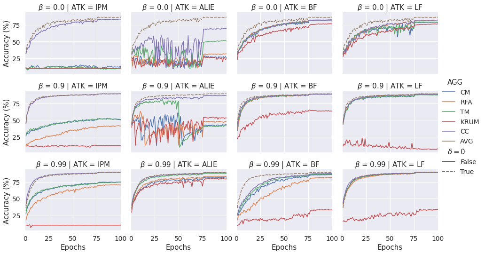

# Learning from History for Byzantine Robust Optimization

This repository contains research code for our [Byzantine robust optimization paper](https://arxiv.org/abs/2012.10333).

Summary:
We study the problem of federated and distributed learning in the presence of untrusted workers who may try to derail the training process. We first describe a simple new aggregator based on iterative **centered clipping** which has significantly stronger theoretical guarantees than previous methods. This aggregator is especially interesting since, unlike most preceding methods, it is very scalable requiring only *O(n)* computation and communication per round. Further, it is also compatible with other strategies such as [asynchronous updates](https://arxiv.org/abs/1604.00981) and [secure aggregation](https://eprint.iacr.org/2017/281.pdf), both of which are crucial for real world applications. Secondly, we show that the time coupled attacks can easily be overcome by using **worker momentum**. 

# Code organization
The structure of the repository is as follows:
- `codes/`
  - Source code.
- `momentum-robustness/`
  - Launcher scripts.
- `outputs/`
  - Store the output of the launcher scripts.
- `notebooks`
  - Process the outputs and make plots.

### Reproduction

To reproduce the results in the paper, do the following steps

1. Add `codes/` to environment variable `PYTHONPATH`
2. Install the dependencies: `pip install -r requirements.txt`
3. Enter `momentum-robusntess/`
  - Run `bash cifar10-all.sh` and select option 2 / 3 / 4 / 5.
  - Run `bash cifar10-CC-HP-explore.sh` and select option 2.
4. The output will be saved to the corresponding folders under `outputs`

Note that if the GPU memory is small (e.g. less than 16 GB), then running the previous commands may raise insufficient exception. In this case, one can decrease the level parallelism in the script by changing the order of loops and reduce the number of parallel processes. 

### Example results

# Reference

If you use this code, please cite the following [paper](https://arxiv.org/abs/2012.10333)

    @inproceedings{karimireddy2020learning,
      author = {Karimireddy, Sai Praneeth and He, Lie and Jaggi, Martin},
      title = "{Learning from History for Byzantine Robust Optimization}",
      booktitle = {ICML 2021 - Proceedings of International Conference on Machine Learning},
      year = 2021,
      url = {https://arxiv.org/abs/2012.10333}
    }

